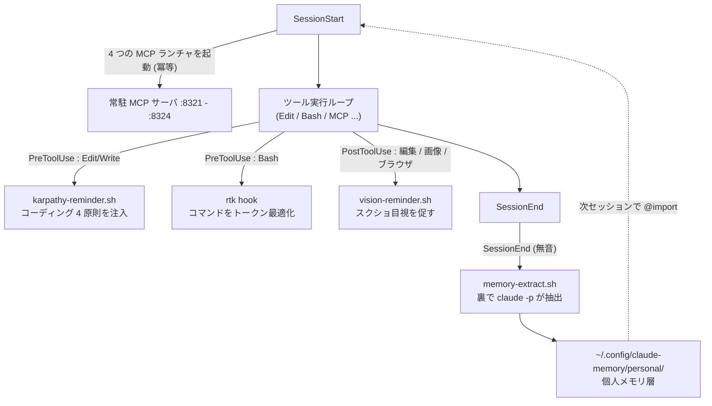
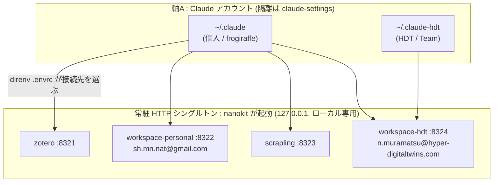

# Claude Code システム構成 (Architecture)

このディレクトリ (`claude/`) は、単なる設定の置き場ではなく **「Claude Code を自分専用にパーソナライズし、複数アカウント・複数プロジェクトを横断して働かせる」ための1つのシステム**になっている。本書はその全体像を1枚で把握するための地図。

> 個々の運用手順・トラブルシュートは重複させない。詳細は [`CLAUDE.md`](./CLAUDE.md) の各 runbook と、設計の背景は [`../docs/2026-06-29_claude-code-multiproject-cleanup.html`](../docs/2026-06-29_claude-code-multiproject-cleanup.html) を参照。

## 何を実現しているか — 3本柱

| 柱 | 狙い | 主要パーツ |
|---|---|---|
| ① 視覚確認の徹底 | UI・図・生成画像を「推測」で済ませず必ず目視 | `vision-reminder.sh` (PostToolUse) + `/visual-verify` skill |
| ② メモリ・パーソナライゼーション | 好み・思考・嗜好を**無音で**収集し全プロジェクトに反映 | `memory-extract.sh` (SessionEnd) + 個人メモリ層 + `@import` |
| ③ マルチアカウント到達性 | どのフォルダからも複数 Google アカウントへ直接届く | 常駐 MCP HTTP シングルトン (`8321`–`8324`) |

---

## 目次

1. [設計の土台](#1-設計の土台)
2. [全体像（フック・ライフサイクル）](#2-全体像フックライフサイクル)
3. [三本柱の詳細](#3-三本柱の詳細)
4. [フック一覧](#4-フック一覧)
5. [常駐 MCP サーバ](#5-常駐-mcp-サーバ)
6. [ディレクトリ構成](#6-ディレクトリ構成)
7. [観測・トラブルシュート](#7-観測トラブルシュート)
8. [もっと詳しく](#8-もっと詳しく)

---

## 1. 設計の土台

3つの前提がシステム全体を貫いている。

- **dotter による symlink 管理** — `claude/` 配下のファイルは [dotter](https://github.com/SuperCuber/dotter) で `~/.claude/` 等へ symlink される。つまり**リポジトリ側を編集 → `dotter deploy` で即反映**が正しいワークフロー。`~/.claude/settings.json` を直接いじるとワーキングツリーが汚れる（symlink 経由なので）。symlink 一覧は [`CLAUDE.md` のシンボリックリンク構造](./CLAUDE.md) 参照。
- **pixi-only** — シェルツール・MCP サーバのランタイムはすべて `pixi global` / pixi env (conda-forge) で管理。`brew` / `pip install` / `cargo install` を使わない。`sudo` 不要・`$HOME/.pixi` 完結・クロスプラットフォーム。
- **二軸アカウントモデル** — 「どの Claude で動くか」と「どの Google データに触るか」を分離して考える。これがマルチアカウント設計の核心。

| 軸 | 何を決めるか | 実体 |
|---|---|---|
| **軸A: Claude アカウント** | どの Claude Code 設定で動くか | `CLAUDE_CONFIG_DIR=~/.claude`（個人）vs `~/.claude-hdt`（HDT） |
| **軸B: データアカウント** | どの Google アカウントのデータに触るか | ポータブルな OAuth creds（`workspace-personal` / `workspace-hdt`） |

軸Bがポータブルな OAuth であるため、**個人の Claude（軸A）からでも HDT の Google データ（軸B）へ到達できる**（＝越境スケジューリング）。

> 軸A の `~/.claude-hdt`（Team アカウント隔離）と、フォルダ毎にどの軸B へ繋ぐかの切替（direnv）は **nanokit ではなく別リポジトリ [`claude-settings`](https://github.com/DenDen047/claude-settings)（private）** が担う。nanokit は個人 `~/.claude` の共通基盤と常駐 MCP サーバを提供する側。詳細は下の §3.3。

---

## 2. 全体像（フック・ライフサイクル）

Claude Code セッションのライフサイクルに、`settings.json` で登録したフックが差し込まれ、それぞれがスクリプトを呼ぶ。



ポイント:

- **`SessionStart`** は MCP サーバを起動するだけ（既に healthy なら no-op の冪等起動）。
- **`PostToolUse` の vision-reminder** はあくまで「目視せよ」という**リマインダ注入**で、実際の確認は本体（あなたが見る or `/visual-verify`）が行う。
- **`SessionEnd` の memory-extract は完全に無音**。会話には一切出ず、裏で headless `claude -p` がトランスクリプトを読んで個人メモリを書く。そのメモリは次セッションで `@import` 経由で読み込まれ、ループが閉じる。

---

## 3. 三本柱の詳細

### 3.1 視覚確認の徹底

Max プランの画像認識を惜しまない方針。**UI・図・ブラウザ画面・生成画像（プロット/SVG/PDF 含む）に触れたら、完了宣言の前に必ずスクショ→`Read` で目視**する。

- フロントエンド編集・プロット生成・ブラウザ操作の後に `PostToolUse` フック (`vision-reminder.sh`) がリマインダを注入。
- 明示確認は `/visual-verify <url|file>` skill（スクショ→チェックリスト採点）。
- SVG/PDF は Vision が直接読めない → PNG 化してから `Read`。
- 発火台帳: `~/.claude/debug/vision-reminder.log`。

### 3.2 メモリ・パーソナライゼーション（3層）

ユーザーの好み・思考・嗜好を集め、全プロジェクトの回答に反映する。**捕捉は自動かつ無音**（会話の途中でメモリを書いたり「保存しました」と実況しない）。

| 層 | 置き場 | 書き手 | 読まれ方 |
|---|---|---|---|
| **① グローバル個人メモリ** | `~/.config/claude-memory/personal/` | `SessionEnd` フック → headless `claude -p`（無音・detached） | `CLAUDE.md` の `@import` で全プロジェクトに読み込み |
| **② プロジェクト固有メモリ** | 各プロジェクトの `memory/` | ネイティブ auto-memory（無音追記） | そのプロジェクトのみ |
| **③ CLAUDE.md への昇格** | `claude/CLAUDE.md` | 人手 | 確定した好みだけ恒久ルール化 |

①の抽出範囲は **網羅的な人物プロファイル**（思考・推論スタイル / コミュニケーション流儀 / 趣味・関心 / 美的嗜好 / 価値観・優先順位 / 専門性 / ツール・ワークフロー / 目標・方向性 / 一緒に働く人 / 振る舞いの修正）。**唯一のハード除外は認証情報**（パスワード・API キー・トークン等）。プロンプトの実体は [`scripts/memory-extract.sh`](./scripts/memory-extract.sh) 内。

> なぜ書き込み先が `~/.claude/` の外なのか: `~/.claude/` 配下は承認ゲート付きの「sensitive file」パスで、headless の `claude -p` が無人で書けない。そのため個人メモリ層は `~/.config/claude-memory/personal/` に置いている。

### 3.3 マルチアカウント到達性（nanokit ⇄ claude-settings の協調）

マルチアカウント／マルチクライアントの実体は **2 リポジトリの協調**で成り立つ。**振り分けの主役は別リポジトリ [`claude-settings`](https://github.com/DenDen047/claude-settings)（private）** で、nanokit は「個人 `~/.claude` の共通基盤」と「常駐 MCP サーバ（プロセス）の実体」を提供する substrate 側に回る。

| 観点 | **nanokit**（この repo） | **claude-settings**（別 repo, private） |
|---|---|---|
| 守備範囲 | 個人 `~/.claude` のグローバル層 | 各クライアント（HDT / OpenHeart / uSonar / Lagoon / personal …）への振り分け |
| 主な実体 | hooks・skills・常駐 MCP サーバの**ランチャ実体**（`workspace-personal :8322` / `workspace-hdt :8324` / `zotero :8321` / `scrapling :8323`） | `templates/<client>/`＋`deploy.sh`＋per-client `.mcp.json` |
| アカウント切替 | —（サーバを立てるだけ） | フォルダ毎に **direnv `.envrc`** が `WORKSPACE_MCP_CREDENTIALS_DIR` / `USER_GOOGLE_EMAIL` / `CLAUDE_CONFIG_DIR` を注入 |
| 軸A 隔離（`~/.claude-hdt`） | 隔離元の `~/.claude/*`（settings.json・skills・scripts・CLAUDE.md 等）を供給 | `setup-config-dirs.sh` が `~/.claude-hdt` を作り、nanokit の `~/.claude/*` を symlink + creds だけ分離 |
| シークレット | （zotero 等 nanokit 固有のみ） | `setup-secrets.sh` + `lib/secret.sh` で全クライアント分を OS ストアへ |

要するに **常駐サーバ（プロセス）は nanokit、どのフォルダがどのアカウントに繋ぐかは claude-settings**。下図で `~/.claude-hdt` ノードと各接続線（どのクライアントがどのサーバへ）を敷設するのは claude-settings、その先で待ち受ける HTTP サーバ群を常駐させるのが nanokit。



- 常駐サーバは **1 プロセスを複数 Claude / Codex が同一 URL で共有**（stdio 二重起動を避ける）。`SessionStart` フック + `ECC_MCP_RECONNECT_*` が冪等起動を担保（nanokit 側）。
- クライアントの接続定義は2系統: **個人 `~/.claude` の user スコープ登録**（`claude mcp add`, nanokit 運用）と、**per-client `.mcp.json`**（`deploy.sh`, claude-settings 運用）。どちらも dotter 管轄外の state なので新ホストでは手動。
- `workspace` は Claude Code の**予約名**なので、個人側は `workspace-personal` を使う。
- 詳細は [`claude-settings`](https://github.com/DenDen047/claude-settings) の README / `specs/claude-code-setup-guide.md` 参照。

---

## 4. フック一覧

`settings.json` の `hooks` で登録されている全フック。

| ライフサイクル | matcher | スクリプト / コマンド | 役割 | 会話への可視性 |
|---|---|---|---|---|
| `SessionStart` | `*` | `zotero` / `workspace-personal` / `workspace-hdt` / `scrapling` の各 `*-server.sh start` | 常駐 MCP を冪等起動 | 不可視（出力無視） |
| `PreToolUse` | `Edit\|Write\|MultiEdit\|NotebookEdit` | `karpathy-reminder.sh` | コーディング 4 原則を初回注入 | system-reminder |
| `PreToolUse` | `Bash` | `rtk hook claude` | Bash コマンドをトークン最適化（透過） | 透過 |
| `PostToolUse` | `Write\|Edit\|MultiEdit\|Bash` | `vision-reminder.sh` | 編集・プロット後にスクショ目視を促す | system-reminder（クールダウン付） |
| `PostToolUse` | `mcp__claude-in-chrome__navigate` | `vision-reminder.sh` | ブラウザ遷移後にスクショ目視を促す | 同上 |
| `SessionEnd` | `*` | `memory-extract.sh` | 個人メモリへ無音抽出（detached `claude -p`） | **完全に不可視** |

補足:
- `SessionEnd` は出力・終了コードが Claude Code に無視される仕様 → 無音を保証。`reason=resume` や短いトランスクリプトはスキップ。再帰防止に子セッションは `MEMEX_CHILD=1` で early-exit。
- 主要な `env`: `model=opus[1m]` / `effortLevel=xhigh` / `autoMemoryEnabled=true` / `defaultMode=auto` / `CLAUDE_CODE_AUTO_COMPACT_WINDOW=1000000`。

---

## 5. 常駐 MCP サーバ

すべて pixi env 内のバイナリを `127.0.0.1` の HTTP で常駐させ、複数クライアントで共有する。

| サーバ | ポート | ランチャ | ランタイム | 備考 |
|---|---|---|---|---|
| `zotero-mcp` | `8321` | [`zotero-mcp-server.sh`](./scripts/zotero-mcp-server.sh) | `mcp-servers/zotero-mcp/` | local / web モード自動切替 |
| `workspace-personal` | `8322` | [`workspace-mcp-personal-server.sh`](./scripts/workspace-mcp-personal-server.sh) | uvx | `sh.mn.nat@gmail.com` |
| `scrapling` | `8323` | [`scrapling-mcp-server.sh`](./scripts/scrapling-mcp-server.sh) | `mcp-servers/scrapling/` | Claude Code ⇄ Codex 共有 |
| `workspace-hdt` | `8324` | [`workspace-mcp-hdt-server.sh`](./scripts/workspace-mcp-hdt-server.sh) | uvx | `n.muramatsu@hyper-digitaltwins.com` |

> 各サーバの credentials・モード切替・接続確認の手順は [`CLAUDE.md`](./CLAUDE.md) の「Zotero MCP 運用」「Scrapling MCP 運用」「Google Workspace MCP 運用」を参照。

---

## 6. ディレクトリ構成

```
claude/
├── CLAUDE.md            # グローバル指示 + 各 MCP 運用 runbook（権威ある詳細はここ）
├── README.md            # Skills / Commands / Sub-agents の概念整理
├── ARCHITECTURE.md      # 本書（システム全体像）
├── RTK.md               # rtk (token killer) リファレンス（CLAUDE.md から @import）
├── settings.json        # hooks / env / permissions / model / plugins
├── scripts/             # フック実装 + MCP ランチャ
│   ├── karpathy-reminder.sh        # PreToolUse: コーディング 4 原則
│   ├── vision-reminder.sh          # PostToolUse: 視覚確認リマインダ
│   ├── memory-extract.sh           # SessionEnd: 無音メモリ抽出
│   ├── zotero-mcp-server.sh        # MCP ランチャ :8321
│   ├── workspace-mcp-personal-server.sh  # MCP ランチャ :8322
│   ├── scrapling-mcp-server.sh     # MCP ランチャ :8323
│   ├── workspace-mcp-hdt-server.sh # MCP ランチャ :8324
│   └── mmdc                        # mermaid CLI ラッパ (→ ~/.pixi/bin/mmdc)
├── skills/              # スキル群（visual-verify, committing-changes, pdf, ...）
├── agents/              # カスタム sub-agent（root-cause, status-briefing）
├── ccstatusline/        # ステータスライン設定（→ ~/.config/ccstatusline/）
├── mcp-servers/         # MCP サーバの pixi env（zotero-mcp, scrapling）
└── external/            # 外部クローン置き場（ARIS 等、dotter 管轄外）
```

システムに直接組み込まれている skill / agent:

| パーツ | 役割 | 連動 |
|---|---|---|
| `skills/visual-verify` | スクショ→チェックリスト採点 | 柱① / vision-reminder |
| `skills/karpathy-guidelines` | コーディング 4 原則の詳細 | karpathy-reminder |
| `skills/committing-changes` | コミット分割＋メッセージ規約 | git commit 前に必須 |
| `agents/root-cause` | 原因切り分け専門 sub-agent | バグ・性能調査 |
| `agents/status-briefing` | Notion/Slack/Gmail/Drive 横断の現状把握 | マルチアカウント収集 |

---

## 7. 観測・トラブルシュート

無音で動く部分が多いので、すべてログで追える。

| 対象 | 確認方法 |
|---|---|
| メモリ抽出（発火台帳） | `tail ~/.claude/debug/memory-extract.log` |
| メモリ抽出（実行ログ） | `~/.claude/debug/memory-extract/<ts>_<sid>.log` |
| メモリ抽出（手動実行） | `bash ~/.claude/scripts/memory-extract.sh --now <transcript.jsonl>` |
| 視覚リマインダ発火 | `tail ~/.claude/debug/vision-reminder.log` |
| MCP サーバ状態 | `bash ~/.claude/scripts/<server>.sh status` / `tail ~/.claude/debug/<server>.log` |
| MCP 接続確認 | `claude mcp list` |
| symlink 健全性 | `readlink ~/.claude/settings.json`（→ nanokit を指せば OK） |

> `~/.claude/settings.json` が通常ファイル化したら、`CLAUDE.md` の「symlink 破壊からの復旧」手順で `rm` → `dotter deploy`。

---

## 8. もっと詳しく

- **マルチアカウント／クライアント振り分けのマスター**: [`claude-settings`](https://github.com/DenDen047/claude-settings)（private）— 各クライアントの `templates/`・`deploy.sh`・direnv `.envrc`・`CLAUDE_CONFIG_DIR` 隔離。nanokit と対になる片割れ。
- **運用 runbook（権威ある詳細）**: [`CLAUDE.md`](./CLAUDE.md) — シンボリックリンク構造 / 環境管理ポリシー / Zotero・Scrapling・Workspace MCP の各運用節。
- **Skills vs Commands vs Sub-agents の概念整理**: [`README.md`](./README.md)。
- **設計の背景・意思決定の記録**: [`../docs/2026-06-29_claude-code-multiproject-cleanup.html`](../docs/2026-06-29_claude-code-multiproject-cleanup.html)。
- **リポジトリ全体（pixi / dotter / シェル）**: [`../README.md`](../README.md)。
